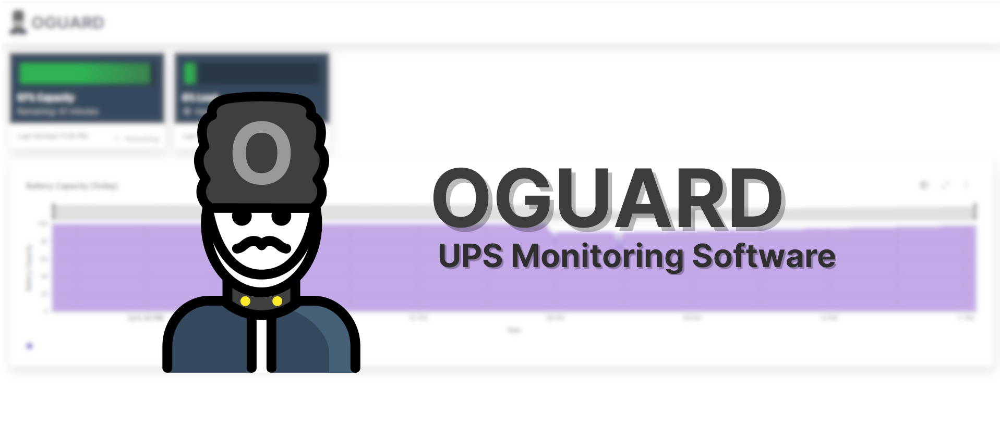
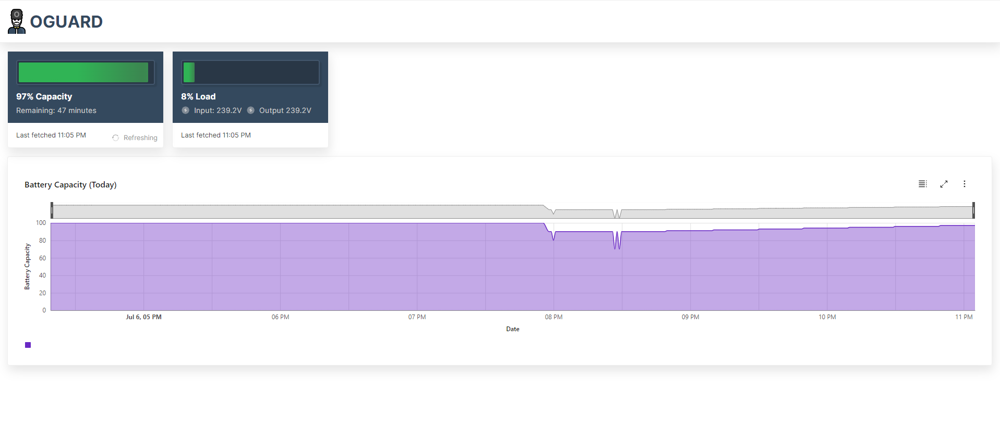

# OGuard

> Work in progress 

**OGuard** is an open source alternative to the [NetGuard](https://powershield.com.au/support-menu/download-area/netguard-software-downloads/) software used by Dynamix UPSs. This is only intended to support 
the "Dynamix UPSD2000 Defender" as this is the only model I own so I won't be implementing the protocols 
for other UPS devices

## Stack

* Monitor (Rust) - Software that tracks the state changes, interacts with the UPS, stores the data, exposes an HTTP API
* Webapp (Svelte, Typescript) - Web application for viewing the app information, state, graphs etc

## Implemented 

So far I've implemented the basic USB HID protocol and can pull the battery and device state information from the device. Below are the features implemented so far:

- Can detect common events (AC Lost, AC Recovered, Fault, Low Battery Start, Low Battery End, Battery Test Start, Battery Test End)
- Events are stored in a SQLite database
- Events are reported through desktop notifications
- Keeps track of a history of the battery and device state (Tracked every minute and stored in the database)
- Basic API, allows querying the current device and battery state, has SSE endpoint that emits events when they happen

## WebUI

Below is a screenshot of the WIP web UI for the app to monitor the capacity and load:

