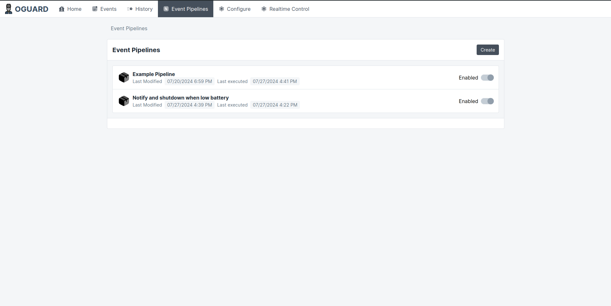

#  OGuard

> Work in progress 

**OGuard** is an open source alternative to the [NetGuard](https://powershield.com.au/support-menu/download-area/netguard-software-downloads/) software used by Dynamix UPSs. This is only intended to support 
the "Dynamix UPSD2000 Defender" as this is the only model I own so I won't be implementing the protocols 
for other UPS devices


## Stack

* Monitor (Rust) - Software that tracks the state changes, interacts with the UPS, stores the data, exposes an HTTP API
* Webapp (Svelte, Typescript) - Web application for viewing the app information, state, graphs etc, managing actions and configuration

## Implemented 

- Can detect common events (AC Lost, AC Recovered, Fault, Low Battery Start, Low Battery End, Battery Test Start, Battery Test End)
- Events are stored in a SQLite database
- Events are reported through desktop notifications
- Keeps track of a history of the battery and device state (Tracked every minute and stored in the database)
- History API, can view all events, battery and device states over time
- Realtime control APIs, control buzzer and battery tests
- Current state API, get the current device and battery states
- Event Pipeline system for triggering actions based on different events (Configurable from webapp)
- Authentication & Authorization for mutating actions


## WebUI

Below is a screenshot of the WIP web UI for the app to monitor the capacity and load:





## Linux

## Configuration

The configuration file is loaded from `/etc/oguard/config.toml` you can find an example [Here](./example-config.toml)

The commands below will set the current config to the example config


```sh
# Create the config directory (Only required for first time)
sudo mkdir /etc/oguard

# Copy the example config
sudo cp ./example-config.toml /etc/oguard/config.toml
```

Development is done on **Fedora** you will need to adapt these commands to your specific distribution

## Native Dependencies

libudev - Used for USB device access, required to build the executable

```sh
sudo dnf install libudev-devel 
```

## Unprivileged USB access

By default linux will not allow access to HID devices without sudo.

You can allow unprivileged access to the UPS HID device by doing the following

Create a rules file at `/etc/udev/rules.d/50-oguard.rules` in this file put the following line:

```
KERNEL=="hidraw*", ATTRS{idVendor}=="0665", ATTRS{idProduct}=="5161", TAG+="uaccess"
```

Then, replug your device or run:

```sh
sudo udevadm control --reload-rules && sudo udevadm trigger
```

This will allow the program to access the device without requiring sudo

## Installation

Below are the instructions for installing:

```sh
# Build release binary
cargo build --release

# Copy release binary to /usr/local/bin
sudo cp ./target/release/oguard /usr/local/bin/oguard

# Create the config directory
sudo mkdir /etc/oguard

# Copy the example config
sudo cp ./example-config.toml /etc/oguard/config.toml

# Copy service to systemd
sudo cp ./oguard.service /etc/systemd/system/oguard.service

# Reload systemctl 
sudo systemctl daemon-reload

# Start the service
sudo systemctl start oguard

# Enable automatic start on boot
sudo systemctl enable oguard

# Verify the service has started
sudo systemctl status oguard
```

## Paths

### Linux

Config file: /etc/oguard/config.toml
Log file: /usr/local/share/oguard/server.log
Database file: /usr/local/share/oguard/app.db

### Windows

(Relative to the executable working directory)

Config file: ./config.toml
Log file: ./data/server.log
Database file: ./data/app.db
